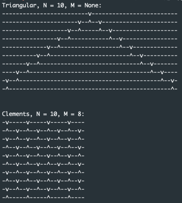
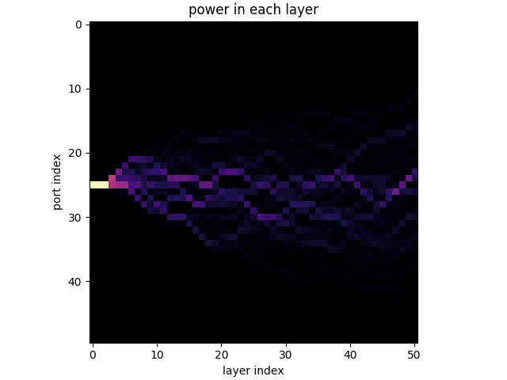
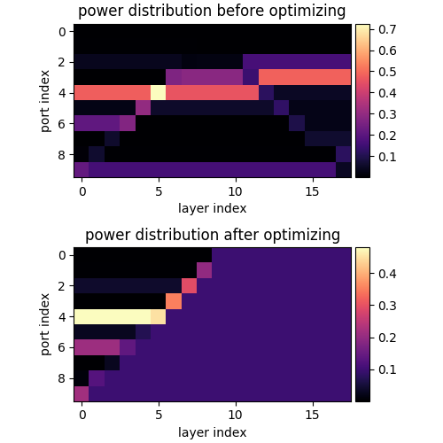

# Accelerator Control

This code simulates a mesh of inteferometers that are used to couple power from an array of optical waveguides to an accelerator on a chip.  It provides mechanisms for simulating and controlling these interferometers using various protocols and algorithms.

For more information, see the accomanying paper draft [here](https://arxiv.org/abs/1902.09731)

## Installation / Usage

To use, simply clone this directory and import the `DLA_Control/` package into your project.  

See `examples/` for more details on how to do this.

## Code Structure:
The code is organized as follows

    DLA_Control/
        alorithms.py
        mesh.py
        plots.py
        util.py
    examples/
        Fig4.py
        Fig5.py
        Fig6.py
        mesh_demo.py
        optimize_demo.py
        phase_fun.py
    tests/
        test_coupling.py
        test_mesh.py
        test_MZI.py

### Package
The main package is contained in `DLA_Control`.

#### Meshes
In `mesh.py`you will find `Mesh` objects that define the MZI mesh and contain all of the relevant transfer matrices.
Currently, `Triangular` and `Clements` meshes are supported.  Printing these Mesh objects prints an ASCII representation of the mesh.



To make a Clements mesh with N ports and M layers and random phase shifter initialization:
    
```python
mesh = Mesh(N, mesh_type='clements', initialization='random', M=M)
print(mesh)
```
    
To make a Triangular mesh with N ports and phase shifter initialized with all zeros (transmission):

```python
mesh = Mesh(N, mesh_type='triangular', initialization='zeros')
print(mesh)
```

To couple light into the mesh and view the power through the device
    
```python
input_values = np.random.random((N,))
mesh.input_couple(input_values)
im = plot_powers(mesh)
plt.show()
```

which will generate a plot like this



For an example see `examples/mesh_demo.py` or the methods of `Mesh` as defined in `DLA_Control/mesh.py`

#### Optimizers

For each `Clements` and `Triangular` meshes, there is an optimizer class that operates on the mesh, changing its MZI phase shifter settings to optimize for a given input-output relation.

These can be initialized with the input and target (complex-valued) mode amplitudes as

```python
TO = TriangleOptimizer(mesh, input_values=input_values, output_target=output_target)
CO = ClementsOptimizer(mesh, input_values=input_values, output_target=output_target)
```

Then, one can call the `optimize()` method on these optimizers with an algorithm to do the tuning.  For example:

```python
CO.optimize(algorithm='smart', verbose=False)
```   

Triangular Optimizers contain `up_down` and `spread` algorithms.  Here's a before and after:



Clements Optimizers contain `smart`, `smart_seq` (which is the one from the paper), and `basic` algorithms.


Read more about these in `DLA_Control/algorithms.py` or see `examples/optmize_demo.py` for more examples.

#### Plotting

`plots.py` defines a few plotting functions.

To plot the progression of power within the device:

```python
im = plot_powers(mesh, ax=None)
```

To make a 3D bar plot of the same image (note, not beautified)

```python
plot_bar_3d(power_map, ax=None)
```

#### Other

`utils.py` contains helper functions for normalizing vectors and getting powers from complex mode amplitudes.


### Examples

As explained previously, the `examples/` directory contains several examples of this package in use.

`Fig{4,5,6}.py` generate the figures in the paper, so you can see how these calculations were performed.


### Tests

Tests cover the individual MZIs up to the full meshes and the optimization protocols.  

To test the individual MZI construction:

```python
python test_MZI.py
```

To test the `Layer` and `Mesh` objects:

```python
python test_mesh.py
```

To test the optimizers

```python
python test_coupling.py
```

To run all tests:

```python
python -m unittest discover tests
```

This can take several minutes.


## Contributing

This code is continuously developing and I am open to collaboration.  If you have any ideas for new features, or find any bugs, please make an issue or submit a pull request. 

Things that would be nice to integrate:

-  Incorporate this code with an actual MZI mesh for controlling an experimental demo.
-  Simulating effects of noise, drift, fabrication errors, etc.
-  Implementing damage / nonlinear constraints.  Fancy algorithms for even power distribution *within* the mesh itself.

## Citing

If you use this package, please cite us as

    @misc{1902.09731,
    Author = {Tyler W. Hughes and R. Joel England and Shanhui Fan},
    Title = {Reconfigurable Photonic Circuit for Controlled Power Delivery to Laser-Driven Accelerators on a Chip},
    Year = {2019},
    Eprint = {arXiv:1902.09731},
    }

## License

This project is licensed under the MIT License - see the [LICENSE.md](LICENSE.md) file for details. Copyright 2018 Tyler Hughes.
